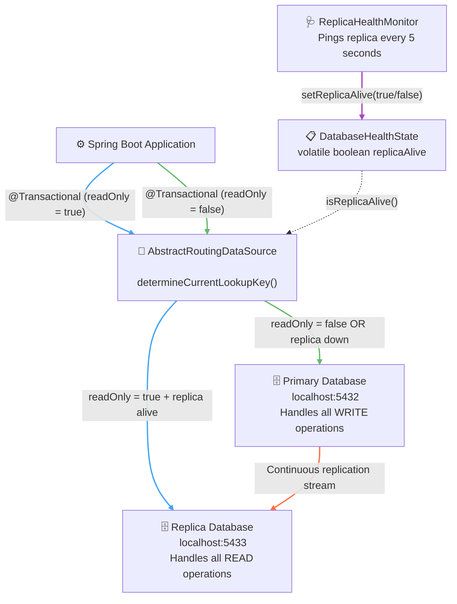
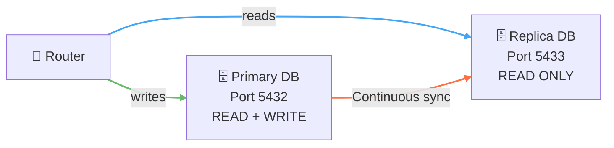
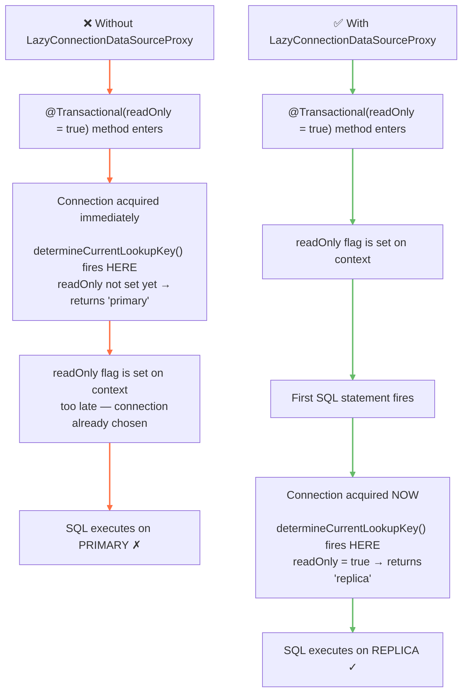

---
tags:
  - Java
  - SpringBoot
  - Database
  - ReadReplica
  - HighAvailability
---

**Target Audience:** Software Engineer 2 | Mid-Level Backend Mastery  
**Core Domain:** Distributed Systems, Advanced Spring Framework Architecture, and Infrastructure Scaling

---

## 🍃 Core Architectural Concepts & Study Guide



---

### 1. What is a Database Read Replica?

A **Read Replica** is a continuously synchronized, read-only mirror of your primary database. The primary instance handles all write operations (`INSERT`, `UPDATE`, `DELETE`) and streams every change to the replica in near real-time. The replica absorbs all read-heavy query traffic (`SELECT`), offloading the primary and dramatically improving throughput.



**Why it matters:**
- Heavy `GET` endpoints no longer compete with `POST`/`PUT`/`DELETE` operations on the same database connection pool.
- With the amount of times a read is called, it is faster this way as it is only a one way connection.

---

### 2. Configuration

The router needs two separate connection pools declared in your config. Spring reads each block independently via `@ConfigurationProperties`.

**`application.yml`**

```yaml
spring:
  datasource:
    primary:
      jdbc-url: jdbc:postgresql://IP_Number_1:5432/myapp_db
      username: myapp_user_1
      password: myapp_pass_1
    replica:
      jdbc-url: jdbc:postgresql://IP_Number_2:5432/myapp_db
      username: myapp_user_2
      password: myapp_pass_2
```


**`application.properties` (equivalent)**

```properties
spring.datasource.primary.jdbc-url=jdbc:postgresql://IP_Number_1:5432/myapp_db
spring.datasource.primary.username=myapp_user_1
spring.datasource.primary.password=myapp_pass_1

spring.datasource.replica.jdbc-url=jdbc:postgresql://IP_Number_2:5432/myapp_db
spring.datasource.replica.username=myapp_user_2
spring.datasource.replica.password=myapp_pass_2
```


> ⚠️ **Rule:** Use `jdbc-url` (not `url`) when configuring HikariCP connection pools via `@ConfigurationProperties`. Spring Boot's auto-config uses `url`, but manual `DataSourceBuilder` pools require `jdbc-url`.

> ⚠️ **Rule:** For docker setup, try using a different `port`.

---

### 3. DataSource Router — The Traffic Manager

The `AbstractRoutingDataSource` intercepts every database call and dynamically selects which connection pool to hand off to — before the query even executes.

#### Imports

```java
import com.pcpartsshop.api.health.DatabaseHealthState;              // Our custom health flag — tells the router if the replica is alive
import org.springframework.beans.factory.annotation.Autowired;
import org.springframework.beans.factory.annotation.Qualifier;    
import org.springframework.boot.context.properties.ConfigurationProperties;
import org.springframework.boot.jdbc.DataSourceBuilder;        
import org.springframework.context.annotation.Bean;
import org.springframework.context.annotation.Configuration;
import org.springframework.context.annotation.Primary;           
import org.springframework.jdbc.datasource.LazyConnectionDataSourceProxy;
import org.springframework.jdbc.datasource.lookup.AbstractRoutingDataSource; 
import org.springframework.transaction.support.TransactionSynchronizationManager;

import javax.sql.DataSource;
import java.util.HashMap;
import java.util.Map;
```

 

---

#### Part 1: The Two Connection Pools — Each Trying to Open Their Own Line

These two beans are independent connection pools. Each reads its own `jdbc-url`, `username`, and `password` from `application.yml` and builds a dedicated **HikariCP** pool — a reservoir of pre-opened database connections ready to be handed out on demand.

```java
@Bean
@ConfigurationProperties("spring.datasource.primary")  // Reads spring.datasource.primary.jdbc-url / username / password
public DataSource primaryDataSource() {
    return DataSourceBuilder.create().build();          // Builds a HikariCP pool pointed at IP_Number_1 Port 5432
}

@Bean
@ConfigurationProperties("spring.datasource.replica")  // Reads spring.datasource.replica.jdbc-url / username / password
public DataSource replicaDataSource() {
    return DataSourceBuilder.create().build();          // Builds a HikariCP pool pointed at IP_Number_2 Port 5432
}
```

 

At this point both pools are alive and eager — but neither is wired to anything yet. They sit in the Application Context toolbox, waiting to be referenced by the router.

> 💡 `@ConfigurationProperties` eliminates boilerplate. Instead of manually calling `setUrl()`, `setUsername()`, `setPassword()` yourself, Spring reads the matching yml block and injects those values directly into the `DataSourceBuilder` before `.build()` fires.

---

#### Part 2: `AbstractRoutingDataSource` — Overriding How the Connection Is Chosen

This is the core of the entire pattern. `AbstractRoutingDataSource` is a Spring-provided abstract class whose only job is to sit in front of multiple connection pools and decide which one to hand off at runtime. We override its single abstract method — `determineCurrentLookupKey()` — to inject our own conditional logic.

```java
@Bean
public AbstractRoutingDataSource dataSourceRouter(
        @Qualifier("primaryDataSource") DataSource primary,   // Pulls the Primary Bean pool from the toolbox by name
        @Qualifier("replicaDataSource") DataSource replica    // Pulls the Replica Bean pool from the toolbox by name
) {
    // Step 1: Register both pools into a lookup map under string keys
    Map<Object, Object> sources = new HashMap<>();
    sources.put("primary", primary);
    sources.put("replica", replica);

    // Step 2: Define the router — overriding the key resolution method
    AbstractRoutingDataSource router = new AbstractRoutingDataSource() {
        @Override
        protected Object determineCurrentLookupKey() {

            // Reads the readOnly flag from the active transaction context
            boolean isRead = TransactionSynchronizationManager.isCurrentTransactionReadOnly();

            // Reads the live health status from our scheduled health monitor
            boolean isReplicaAlive = databaseHealthState.isReplicaAlive();

            // Decision: only use replica if BOTH conditions are true
            // If replica is down, silently fall back to primary regardless of readOnly
            return isRead && isReplicaAlive ? "replica" : "primary";
        }
    };

    // Step 3: Hand the map to the router and set the default fallback
    router.setTargetDataSources(sources);
    router.setDefaultTargetDataSource(primary); // Safety net: if key resolution returns null, use primary
    router.afterPropertiesSet();                // Finalizes internal state — must be called manually since we build this by hand
    return router;
}
```

 

`determineCurrentLookupKey()` is called **before every single database operation**. It returns a string key, the router looks that key up in the map, and hands back the matching connection pool. The calling code — your repository, your service — never knows which pool it received.

> 💡 **Why `@Qualifier` here?** At this point Spring's toolbox has *three* `DataSource` beans — `primaryDataSource`, `replicaDataSource`, and eventually the final wrapped one. Without `@Qualifier`, Spring doesn't know which two to inject and throws an ambiguity error.

---

#### Part 3: `LazyConnectionDataSourceProxy` — Making Every Connection Wait

This is the most subtle but most critical piece. Without it, the entire routing mechanism silently breaks.

```java
@Bean
@Primary  // This is the DataSource Spring injects into JPA, repositories, and everything else
public DataSource dataSource(AbstractRoutingDataSource dataSourceRouter) {
    return new LazyConnectionDataSourceProxy(dataSourceRouter);
}
```

 

By default, Spring's transaction manager acquires a physical database connection the moment a `@Transactional` method is entered — *before* any SQL has been written, and *before* the `readOnly` flag has been registered on the transaction context. This means `determineCurrentLookupKey()` fires too early, reads `isCurrentTransactionReadOnly()` as `false`, and always returns `"primary"` — routing all traffic to primary even for read operations.

`LazyConnectionDataSourceProxy` wraps the router and tells Spring: **do not open a real connection yet**. Hold back. Wait until the very first SQL statement is about to execute — by then the transaction context is fully initialized, the `readOnly` flag is set, and `determineCurrentLookupKey()` fires at the correct moment with the correct value.




> 💡 Think of it as a non-async synchronization barrier — similar to how you'd block a thread until a condition is ready before proceeding. The proxy enforces that the connection handshake only happens after the transaction state is fully settled, not before.

---

**How routing is triggered in your service layer:**

```java
@Transactional(readOnly = true)   // Router sends this to REPLICA
public Page<ProductResponse> getAllProducts(...) { ... }

@Transactional                    // Router sends this to PRIMARY (readOnly defaults to false)
public ProductResponse createProduct(...) { ... }
```

 

> 💡 **Do you always need `@Transactional(readOnly = true)` explicitly?**  
> Not for standard repository methods. Spring Data's `SimpleJpaRepository` — the internal class that powers every `JpaRepository` you extend — is already annotated with `@Transactional(readOnly = true)` at the class level. This means built-in read methods like `findById()` and `findAll()` will automatically route to the replica without any extra annotation on your part.
>
> However, **any custom service method you write that performs reads** will default to a non-read-only transaction unless you explicitly annotate it:
>
> ```java
> // Will route to replica — SimpleJpaRepository handles this automatically
> productRepository.findAll();
>
> // Will route to replica — you explicitly declared readOnly
> @Transactional(readOnly = true)
> public Page<ProductResponse> getAllProducts(...) { ... }
>
> // Will route to PRIMARY — no readOnly flag, even though it only reads
> @Transactional
> public Page<ProductResponse> getAllProducts(...) { ... }
> ```
>
> **The rule:** repository calls are covered by default. Service-level methods that orchestrate reads need the annotation explicitly.

---

### 4. Health Monitoring (Optional — Recommended for Uptime)

> 💡 **This section is optional** but strongly recommended for any production deployment. Without a health monitor, if your replica goes down, every `readOnly` transaction will throw a connection error instead of gracefully falling back to the primary.

The health monitor is split into two classes intentionally — **state** and **behavior** are separated for clean dependency injection.

#### File A: `DatabaseHealthState` — The Shared State Flag

A lightweight Spring-managed component holding a single `volatile boolean`. The `volatile` keyword guarantees that any thread reading this flag always sees the latest value written by the scheduler thread — critical in a multi-threaded application server.

```java
package com.pcpartsshop.api.health;

import lombok.Data;
import org.springframework.stereotype.Component;

@Component
@Data
public class DatabaseHealthState {

    private volatile boolean replicaAlive = true;
}
```

 

#### File B: `ReplicaHealthMonitor` — The Scheduled Ping

Runs every 5 seconds in the background. Attempts a real JDBC connection to the replica — if it succeeds, the replica is marked alive. If it throws any exception, the replica is marked down and the router automatically falls back to primary on the next request.

```java
package com.pcpartsshop.api.health;

import org.springframework.beans.factory.annotation.Autowired;
import org.springframework.beans.factory.annotation.Qualifier;
import org.springframework.scheduling.annotation.Scheduled;
import org.springframework.stereotype.Component;

import javax.sql.DataSource;
import java.sql.Connection;

@Component
public class ReplicaHealthMonitor {

    @Autowired
    @Qualifier("replicaDataSource")
    private DataSource replicaDataSource;

    @Autowired
    private DatabaseHealthState databaseHealthState;

    @Scheduled(fixedDelay = 5000)
    public void checkReplicaHealth() {
        try (Connection connection = replicaDataSource.getConnection()) {
            databaseHealthState.setReplicaAlive(true);
        } catch (Exception error) {
            databaseHealthState.setReplicaAlive(false);
        }
    }
}
```

 

> ⚠️ **Remember:** Add `@EnableScheduling` to your main application class, otherwise `@Scheduled` methods will never execute.

```java
@SpringBootApplication
@EnableScheduling
public class ApiApplication { ... }
```

 

---

### 5. Glossary

| Component / Directive | Real-World System Analogy | Definitive Operational Meaning |
| :--- | :--- | :--- |
| **Read Replica** | **The Read-Only Branch Office** | A continuously synchronized, read-only mirror of the primary database that absorbs SELECT query traffic to offload the primary write node. |
| **Primary Database** | **The Central Headquarters** | The single authoritative write node. All `INSERT`, `UPDATE`, and `DELETE` operations are routed here exclusively. |
| **`AbstractRoutingDataSource`** | **The Traffic Cop** | A Spring JDBC abstraction that intercepts every database call and dynamically selects which connection pool to use based on `determineCurrentLookupKey()`. |
| **`determineCurrentLookupKey()`** | **The Routing Decision** | Called before every query. Returns `"replica"` for read-only transactions or `"primary"` for write transactions and fallback scenarios. |
| **`LazyConnectionDataSourceProxy`** | **The Deferred Handshake** | Wraps the router and holds all connections back until the first SQL statement executes, ensuring the transaction context is fully initialized before routing fires. |
| **`@Transactional(readOnly = true)`** | **The Read Lane Signal** | Marks a transaction as read-only, which `TransactionSynchronizationManager` exposes as a flag that the router reads to select the replica pool. |
| **`SimpleJpaRepository`** | **The Pre-Wired Default** | Spring Data's internal implementation of `JpaRepository`, already annotated with `@Transactional(readOnly = true)` — built-in repo methods route to replica automatically. |
| **`volatile boolean`** | **The Thread-Safe Bulletin Board** | Guarantees that the health flag written by the scheduler thread is immediately visible to all other threads reading it — no stale cache reads. |
| **`@Scheduled(fixedDelay = 5000)`** | **The Recurring Heartbeat Ping** | Triggers the annotated method 5 seconds after the previous execution completes, continuously monitoring replica availability in the background. |
| **`DatabaseHealthState`** | **The Shared State Flag** | A Spring-managed singleton holding the current replica health status, shared between the health monitor (writer) and the router (reader). |