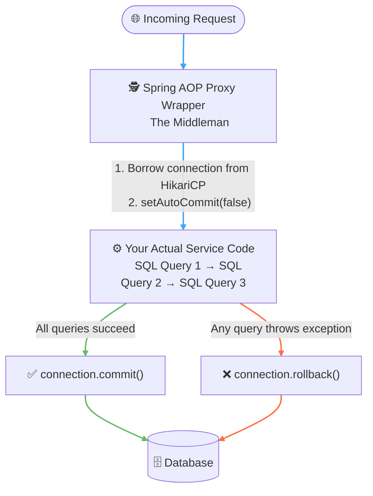
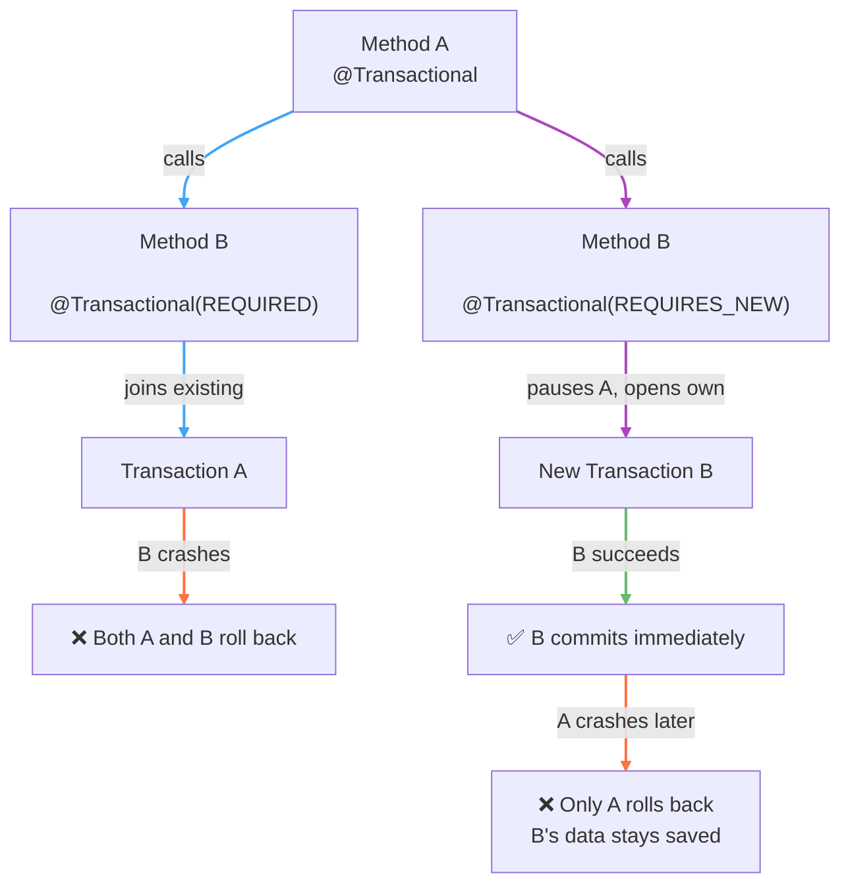
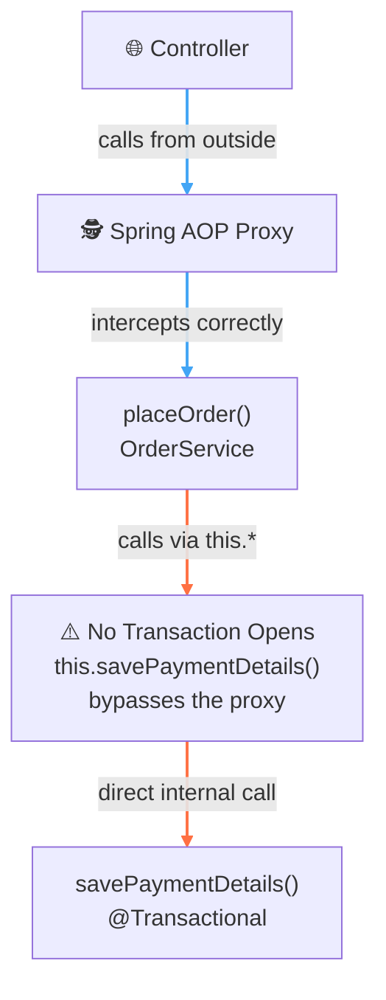

---

tags:

- Java
- SpringBoot
- Transactional
- Database

---
*A deep-dive map of data consistency, proxy mechanics, and application safety. Covers how Spring AOP abstracts transaction lifecycles using the `@Transactional` annotation, details critical propagation rules (`REQUIRED` vs. `REQUIRES_NEW`) for nested operations, exposes the dangerous default behavior of the `rollbackFor` trap regarding checked exceptions, and diagnoses the architectural limitations of proxy self-invocation and visibility constraints that silently break transactional boundaries.*

**Target Audience:** Software Engineer 2 | Mid-Level Backend Mastery  
**Core Domain:** Distributed Systems, Advanced Spring Framework Architecture, and Infrastructure Scaling

---

## 🍃 Core Architectural Concepts & Study Guide



---

### 1. What is `@Transactional`? — The "All or Nothing" Rule

`@Transactional` enforces **ACID atomicity** across multiple database operations. If your method updates a user profile, saves a payment log, and increments an invoice count — you cannot afford to have the payment saved if the invoice counter crashes. Either all three succeed together, or none of them do.

When Spring sees `@Transactional` on a method, it doesn't hand your raw service class to the caller. Instead it creates an invisible **AOP Proxy Wrapper** around your class — a middleman that intercepts the call, opens a connection, turns off auto-commit, runs your code, and either commits or rolls back depending on the outcome.

**What Spring does automatically so you don't have to:**

```java
// The old-school JDBC equivalent of what @Transactional does behind the scenes
Connection conn = dataSource.getConnection();
try {
    conn.setAutoCommit(false);
    // ... your queries execute here ...
    conn.commit();
} catch (Exception e) {
    conn.rollback();
} finally {
    conn.close();
}
```

 

Instead of littering your codebase with repetitive try-catch rollback blocks, you drop `@Transactional` on top of the method and Spring abstracts the entire transaction lifecycle out of sight.

---

### 2. Transaction Propagation — The Nested Methods Strategy

Propagation defines how a transaction behaves when one `@Transactional` method calls another `@Transactional` method. There are seven types, but two cover 95% of backend engineering tasks:



- **`REQUIRED` (Default) — "Join the existing club"**
    
    - If Method A is already running a transaction and calls Method B set to `REQUIRED`, Method B jumps inside Method A's transaction boundary. If Method B crashes, everything — A and B — rolls back together.
- **`REQUIRES_NEW` — "Pause the current club, I'm opening my own"**
    
    - When Method A calls Method B set to `REQUIRES_NEW`, the engine pauses Method A's transaction and opens a completely separate database connection for Method B. If Method B finishes successfully it commits immediately — even if Method A crashes 5 seconds later, Method B's changes stay saved. Perfect for independent tasks like audit trails or security access logs.

---

### 3. The `rollbackFor` Trap — Spring's Dangerous Default

By default, Spring `@Transactional` **only rolls back for unchecked exceptions** — subclasses of `RuntimeException` like `NullPointerException` or `IllegalArgumentException`.

If your method throws a **checked exception** like `IOException`, `SQLException`, or a custom business exception that extends `Exception`, Spring's default behavior will print the error to the console but **still commit the broken data to your database**.

```java
// ⚠️ DANGEROUS — IOException will NOT trigger a rollback by default
@Transactional
public void processOrder() throws IOException {
    saveUser();
    savePayment();
    throw new IOException("Network failure"); // data is still committed!
}

// ✅ SAFE — rolls back for ANY exception, checked or unchecked
@Transactional(rollbackFor = Exception.class)
public void processOrder() throws IOException {
    saveUser();
    savePayment();
    throw new IOException("Network failure"); // rollback triggered
}
```

 

> ⚠️ **Golden Rule:** Always use `@Transactional(rollbackFor = Exception.class)` on any method that can throw a checked exception. Never assume the default is safe.

---

### 4. The Two Ways to Break `@Transactional`

Because Spring relies on an AOP Proxy to intercept calls, the proxy has hard limitations. Both of these silently do nothing — no error, no warning, just broken transaction boundaries.

#### Trap A: Private or Protected Methods

```java
// ❌ Spring's proxy cannot see private methods from the outside
@Transactional
private void savePaymentDetails() {
    // Transaction boundary NEVER opens — annotation is silently ignored
}

// ✅ Must be public for the proxy to intercept it
@Transactional
public void savePaymentDetails() {
    // Transaction boundary opens correctly
}
```

 

#### Trap B: Self-Invocation (Calling a Method in the Same Class)

```java
@Service
public class OrderService {

    // ❌ Calls savePaymentDetails() via 'this' — bypasses the proxy entirely
    public void placeOrder() {
        this.savePaymentDetails(); // proxy never intercepted — no transaction opens
    }

    @Transactional
    public void savePaymentDetails() {
        // SQL queries here will NOT rollback if they crash
    }
}
```

 

Because `placeOrder()` calls `savePaymentDetails()` using the local `this` keyword, it bypasses the Spring Proxy Wrapper entirely. The request never hits the middleman, so `setAutoCommit(false)` is never called.



**The fix:** move `savePaymentDetails()` into a separate service class so the call goes through the proxy from the outside.

```java
@Service
public class OrderService {

    @Autowired
    private PaymentService paymentService; // separate bean — call goes through proxy

    public void placeOrder() {
        paymentService.savePaymentDetails(); // ✅ proxy intercepts — transaction opens
    }
}

@Service
public class PaymentService {

    @Transactional
    public void savePaymentDetails() {
        // Transaction boundary opens correctly
    }
}
```

 

---

### 5. Glossary

| Component / Directive               | Real-World System Analogy                        | Definitive Operational Meaning                                                                                                                                    |
| :---------------------------------- | :----------------------------------------------- | :---------------------------------------------------------------------------------------------------------------------------------------------------------------- |
| **`@Transactional`**                | **The All-or-Nothing Contract**                  | Wraps a method in a transaction boundary — either every query inside commits together or all of them roll back on any exception.                                  |
| **AOP Proxy Wrapper**               | **The Invisible Middleman**                      | A dynamically generated class Spring wraps around your service to intercept method calls and inject transaction lifecycle management without touching your code.  |
| **`setAutoCommit(false)`**          | **The Pause Button**                             | Tells the database connection to hold all changes in a pending buffer instead of persisting them immediately after each SQL statement.                            |
| **`REQUIRED`**                      | **Join the Existing Club**                       | Default propagation — the called method joins the caller's transaction. A crash in either rolls back both.                                                        |
| **`REQUIRES_NEW`**                  | **Open Your Own Club**                           | Pauses the caller's transaction and opens a completely independent one. The inner method commits or rolls back independently of the outer method.                 |
| **`rollbackFor = Exception.class`** | **The Safety Net Override**                      | Extends Spring's default rollback trigger from only `RuntimeException` to all exceptions, including checked ones like `IOException`.                              |
| **Self-Invocation**                 | **The Internal Shortcut That Breaks Everything** | Calling a `@Transactional` method via `this.*` inside the same class bypasses the AOP proxy — the transaction boundary silently never opens.                      |
| **HikariCP**                        | **The Connection Pool**                          | A high-performance JDBC connection pool that Spring borrows physical database connections from at transaction start and returns them to after commit or rollback. |