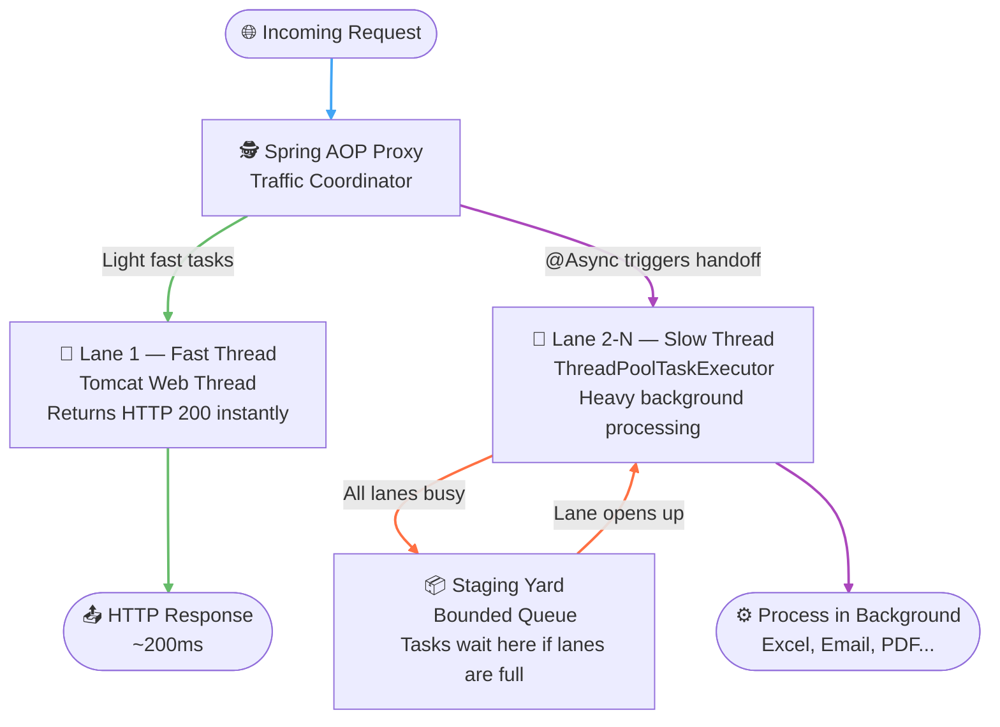
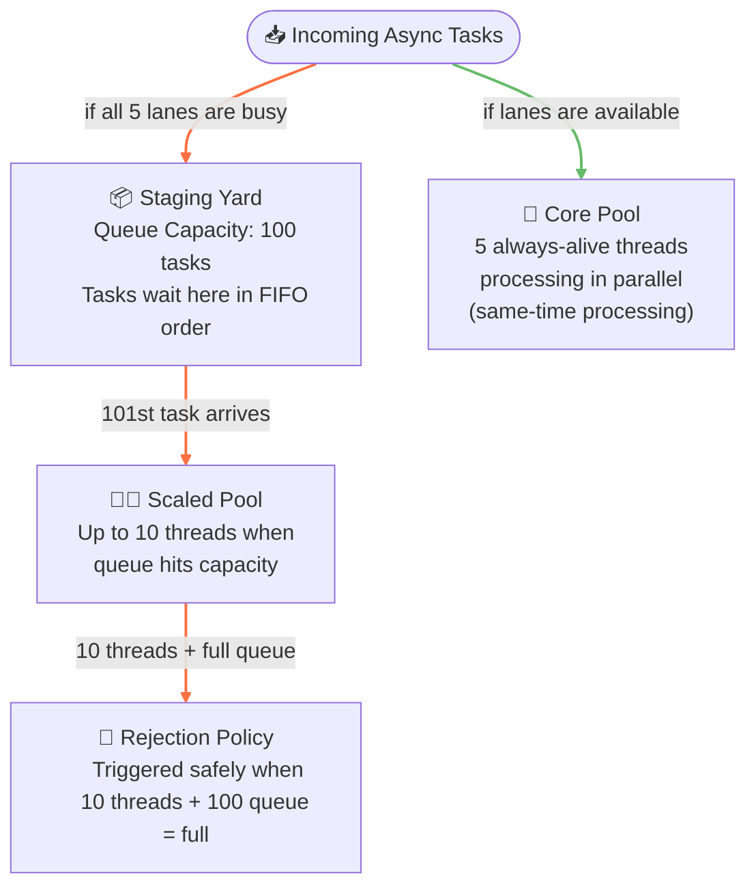
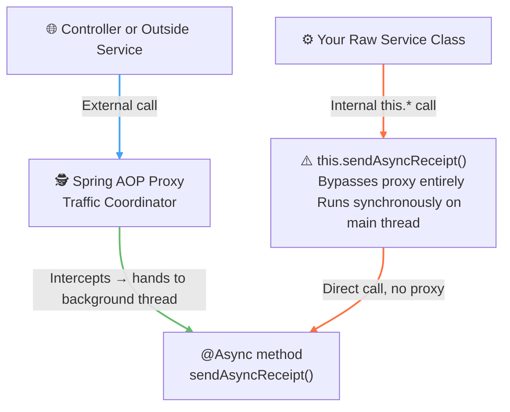
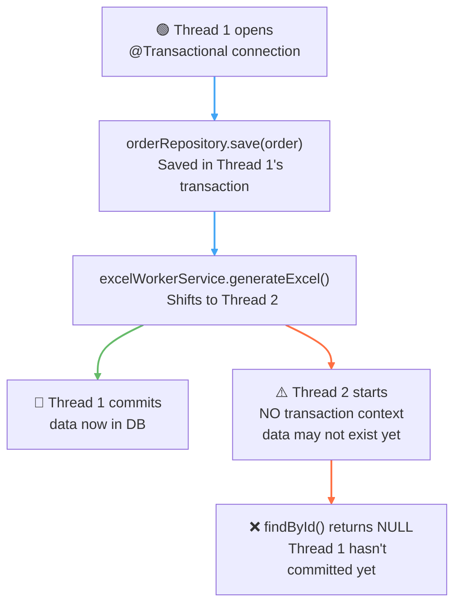

---

tags:

- Java
- SpringBoot
- Async
- Threading

---
*A deep-dive map of non-blocking execution pipelines and concurrency isolation. Covers how Spring AOP coordinates task hand-offs using the `@Async` annotation, the explicit configuration of bounded `ThreadPoolTaskExecutor` architectures to safeguard against resource starvation, methods for parallel task orchestration via `CompletableFuture`, background failure capture utilizing `AsyncUncaughtExceptionHandler`, and the critical synchronization mechanics required to safely bridge thread boundaries without violating `@Transactional` consistency.*

**Target Audience:** Software Engineer 2 | Mid-Level Backend Mastery  
**Core Domain:** Distributed Systems, Advanced Spring Framework Architecture, and Infrastructure Scaling

---

## 🍃 Core Architectural Concepts & Study Guide



---

### 1. What is `@Async`? — The Multi-Lane Expressway

Think of standard Spring Boot code as a **single-lane road**. One thread handles everything from start to finish. If that thread hits a slow task — generating a 50-page PDF, sending 1,000 emails — the entire lane halts. The user stares at a spinner while the thread can't return a response until every line finishes.

`@Async` converts that single-lane highway into a **multi-lane expressway** with dedicated fast and slow threads:

- **The Fast Thread (Tomcat Web Thread):** Strictly reserved for fast traffic. Fetching profiles, loading lists, verifying passwords. Goal: stay under 200ms. No heavy tasks allowed.
- **The Slow Thread (`ThreadPoolTaskExecutor`):** When your code hits `@Async`, the Spring Proxy shifts that task packet over to the slow background thread. These threads process compute-heavy work without touching the fast traffic. They can back up into a staging queue — but the user's task in the fast thread already cleared the passage and received `HTTP 200 OK`.

**The key difference from a single lane:**

|                              | Synchronous (Single Lane)    | `@Async` (Multi-Lane)        |
| :--------------------------- | :--------------------------- | :--------------------------- |
| User clicks "Generate Excel" | Thread blocks for 10 seconds | Thread hands off instantly   |
| Response time                | ~10,000ms                    | ~200ms                       |
| User experience              | Spinner, waiting             | "Your report is generating!" |
| Heavy work                   | On the main thread           | Background slow thread       |
> 💡 **In short:** Use `@Async` when you want to return a response to the user while a background process is still running — instead of making them wait for it to finish.

---

### 2. Setup — `ThreadPoolTaskExecutor`

> ⚠️ **Never use `@Async` without configuring a `ThreadPoolTaskExecutor`.**  
> The default fallback (`SimpleAsyncTaskExecutor`) spins up a brand new OS thread for every single async call. 10,000 users clicking your export button = 10,000 threads = server crash.

Add `@EnableAsync` to activate Spring's async machinery, then define a bounded thread pool:

```java
import org.springframework.context.annotation.Bean;
import org.springframework.context.annotation.Configuration;
import org.springframework.scheduling.annotation.EnableAsync;
import org.springframework.scheduling.concurrent.ThreadPoolTaskExecutor;

import java.util.concurrent.Executor;

@Configuration
@EnableAsync // Turns on Spring's async proxy interception
public class AsyncConfig {

    @Bean(name = "taskExecutor")
    public Executor taskExecutor() {
        ThreadPoolTaskExecutor executor = new ThreadPoolTaskExecutor();
        executor.setCorePoolSize(5);        // Keep 5 threads alive at all times
        executor.setMaxPoolSize(10);        // Scale up to 10 if under heavy load
        executor.setQueueCapacity(100);     // Queue up to 100 tasks if all lanes are busy
        executor.setThreadNamePrefix("AsyncThread-");
        executor.initialize();
        return executor;
    }
}
```

 

**How the pool acts as a safety guard:**



---

### 3. Basic Usage

Once configured, annotate your method and point it to the executor bean name:

```java
import org.springframework.scheduling.annotation.Async;
import org.springframework.stereotype.Service;

@Service
public class EmailService {

    @Async("taskExecutor") // Matches the @Bean name in AsyncConfig
    public void sendMassEmail(User user) {
        // Runs entirely inside a thread named "AsyncThread-X"
        // Slow network operations, API calls, file writes go here
        System.out.println("Thread: " + Thread.currentThread().getName());
    }
}
```

 

or you can use `@Qualifier`. It effectively does the same thing as above.

```java
import org.springframework.beans.factory.annotation.Qualifier;
import org.springframework.scheduling.annotation.Async;
import org.springframework.stereotype.Service;

@Service
public class EmailService {

    @Async
    @Qualifier("taskExecutor") // Resolves the executor bean by name
    public void sendMassEmail(User user) {
        // Runs entirely inside a thread named "AsyncThread-X"
        // Slow network operations, API calls, file writes go here
        System.out.println("Thread: " + Thread.currentThread().getName());
    }
}
```

 

> 💡 **When should you use `@Async`?** Ask yourself: _does the HTTP request need the output of this method to respond to the user right now?_
> 
> - **YES** (login, fetch profile, verify password) → keep it synchronous
> - **NO** (generate Excel/PDF, send email, sync analytics) → use `@Async`

---

### 4. The Proxy Trap — Why `this.method()` Breaks `@Async`

`@Async` uses the exact same AOP Proxy mechanism as `@Transactional`. The proxy wraps your class from the outside — it only intercepts calls that cross class boundaries.



**❌ The Wrong Way — `this.*` bypasses the proxy:**

```java
@Service
public class OrderService {

    public void placeOrder() {
        this.sendAsyncReceipt(); // proxy never intercepted — runs synchronously, blocks main thread
    }

    @Async("taskExecutor")
    public void sendAsyncReceipt() {
        // @Async is silently ignored — still on the main thread
    }
}
```

 

**✅ Fix Option A — Separate Service (Recommended):**

```java
import org.springframework.beans.factory.annotation.Autowired;
import org.springframework.scheduling.annotation.Async;
import org.springframework.stereotype.Service;

@Service
public class OrderService {

    @Autowired
    private EmailWorkerService emailWorkerService; // Separate bean — crosses class boundary

    public void placeOrder() {
        emailWorkerService.sendAsyncReceipt(); // Hits proxy correctly → background thread
    }
}

@Service
public class EmailWorkerService {

    @Async("taskExecutor")
    public void sendAsyncReceipt() {
        // Runs asynchronously in background thread
    }
}
```

 

**✅ Fix Option B — Self-Injection (Last Resort):**

```java
import org.springframework.beans.factory.annotation.Autowired;
import org.springframework.context.annotation.Lazy;
import org.springframework.scheduling.annotation.Async;
import org.springframework.stereotype.Service;

@Service
public class OrderService {

    @Autowired
    @Lazy // Prevents circular dependency on startup
    private OrderService self; // Injects the proxy wrapper, not the raw class

    public void placeOrder() {
        self.sendAsyncReceipt(); // Calls through the proxy — works correctly
    }

    @Async("taskExecutor")
    public void sendAsyncReceipt() {
        // Runs asynchronously because it went through the proxy
    }
}
```

 

> ⚠️ Stick to Option A whenever possible — it keeps your codebase modular and eliminates any risk of accidentally blocking your fast thread.
---

### 5. Handling Thread Failures — `AsyncUncaughtExceptionHandler`

With synchronous methods, exceptions bubble up to the controller and get caught by `@ControllerAdvice`. With `@Async`, **the web thread has already returned a response and left**. If a background thread crashes halfway through generating an Excel file, the exception is thrown into the void — the user never knows why their file never arrived.

For `void` async methods, Spring provides a dedicated safety net:

**File A: The Custom Exception Handler**

```java
import org.springframework.aop.interceptor.AsyncUncaughtExceptionHandler;

import java.lang.reflect.Method;

public class CustomAsyncExceptionHandler implements AsyncUncaughtExceptionHandler {

    @Override
    public void handleUncaughtException(Throwable throwable, Method method, Object... obj) {
        System.err.println("Async Thread Exception: " + throwable.getMessage());
        System.err.println("Method Name: " + method.getName());

        // Production move: update DB audit status to FAILED,
        // or trigger an alert (Slack, PagerDuty, etc.)
    }
}
```

 

**File B: Register it in `AsyncConfig`**

```java
import org.springframework.aop.interceptor.AsyncUncaughtExceptionHandler;
import org.springframework.context.annotation.Configuration;
import org.springframework.scheduling.annotation.AsyncConfigurer;
import org.springframework.scheduling.annotation.EnableAsync;
import org.springframework.scheduling.concurrent.ThreadPoolTaskExecutor;

import java.util.concurrent.Executor;

@Configuration
@EnableAsync
public class AsyncConfig implements AsyncConfigurer {

    @Override
    public Executor getAsyncExecutor() {
        ThreadPoolTaskExecutor executor = new ThreadPoolTaskExecutor();
        executor.setCorePoolSize(5);
        executor.setMaxPoolSize(10);
        executor.setQueueCapacity(100);
        executor.setThreadNamePrefix("AsyncThread-");
        executor.initialize();
        return executor;
    }

    @Override
    public AsyncUncaughtExceptionHandler getAsyncUncaughtExceptionHandler() {
        return new CustomAsyncExceptionHandler(); // Hooks up the safety net
    }
}
```

 

---

### 6. Returning Data — `CompletableFuture`

Sometimes you can't fire-and-forget. If you need to fetch data from three separate third-party APIs (Shipping Rates, Tax Calculator, Inventory Status) to complete a single checkout — running them sequentially takes too long. You need all three running simultaneously on separate threads and merged at the end.

Instead of returning `void`, use `CompletableFuture<T>` — a Java wrapper that promises a value will arrive in the future:

```java
import org.springframework.scheduling.annotation.Async;
import org.springframework.stereotype.Service;

import java.util.concurrent.CompletableFuture;

@Service
public class ThirdPartyService {

    @Async("taskExecutor")
    public CompletableFuture<Double> getShippingRates() {
        Thread.sleep(2000); // Simulating slow external API call
        return CompletableFuture.completedFuture(45.50);
    }

    @Async("taskExecutor")
    public CompletableFuture<Double> getTaxCalculations() {
        Thread.sleep(1500);
        return CompletableFuture.completedFuture(12.00);
    }
}
```

 

**Merging them in parallel (The Orchestrator):**

```java
import org.springframework.beans.factory.annotation.Autowired;
import org.springframework.stereotype.Service;

import java.util.concurrent.CompletableFuture;

@Service
public class CheckoutService {

    @Autowired
    private ThirdPartyService thirdPartyService;

    public CheckoutSummary processCheckout() throws Exception {
        // Triggers BOTH threads simultaneously
        CompletableFuture<Double> shippingFuture = thirdPartyService.getShippingRates();
        CompletableFuture<Double> taxFuture = thirdPartyService.getTaxCalculations();

        // Block and wait for both lanes to finish
        CompletableFuture.allOf(shippingFuture, taxFuture).join();

        Double shippingCost = shippingFuture.get();
        Double taxCost = taxFuture.get();

        // Total time: Max(2000ms, 1500ms) = 2s instead of 3.5s sequential
        return new CheckoutSummary(shippingCost + taxCost);
    }
}
```

 

---

### 7. Database Transaction Boundaries — `@Async` + `@Transactional`

> ⚠️ **Golden Rule:** Spring's `@Transactional` boundary is strictly bound to a **single thread via `ThreadLocal` storage**. It does not carry over to background threads.



**The safe fix — fire the async thread only after the transaction fully commits:**

```java
import org.springframework.beans.factory.annotation.Autowired;
import org.springframework.transaction.annotation.Transactional;
import org.springframework.transaction.support.TransactionSynchronization;
import org.springframework.transaction.support.TransactionSynchronizationManager;
import org.springframework.stereotype.Service;

@Service
public class OrderService {

    @Autowired
    private ExcelWorkerService excelWorkerService;

    @Transactional
    public void placeOrder(Order order) {
        orderRepository.save(order);

        // Register a hook that fires AFTER the DB commit completes
        TransactionSynchronizationManager.registerSynchronization(new TransactionSynchronization() {
            @Override
            public void afterCommit() {
                // Thread 2 wakes up safely — data is guaranteed to be in DB
                // This method should be annotated with @Async
                excelWorkerService.generateExcel(order.getId());
            }
        });
    }
}
```

 

---

### 8. `@Async` vs Jobs — What's the Difference?

| Feature            | `@Transactional`            | `@Async`                      | `@Scheduled`              | Managed Job Queue          |
| :----------------- | :-------------------------- | :---------------------------- | :------------------------ | :------------------------- |
| **Trigger**        | Method call                 | User-triggered event          | Time-based (cron)         | User-triggered event       |
| **Storage**        | DB connection (ThreadLocal) | JVM Memory (RAM)              | N/A                       | External (Redis, DB, MQ)   |
| **Crash Survival** | Rolls back cleanly          | ❌ Task lost on restart        | Resumes on next schedule  | ✅ Task persists in queue   |
| **Scale**          | Single thread               | Single app instance           | Single app instance       | Multiple worker servers    |
| **Use case**       | Multi-step DB integrity     | Non-critical background tasks | Automated system routines | Mission-critical async ops |

>💡 Use `@Async` for light-to-medium background tasks where a server restart dropping the task is acceptable (emails, webhooks, minor file updates). Use a formal job queue for mission-critical operations (financial transactions, heavy video processing, bulk inventory syncs).

> 💡 **Quick Mental Model**
> **`@Transactional`** — safety net for DB writes. Multiple operations that must succeed or fail together.
> **`@Async`** — don't make the user wait. Offload slow tasks like file generation, emails, and third-party API calls to a background thread.
> **`@Scheduled`** — automated system routines on a timer. Midnight cleanups, weekly reports, token expiry purges. Runs independent of user actions.
> **Jobs/Queues** — don't lose the work. For bulk uploads, financial transactions, and anything that must survive a server crash and be retried on failure.

---

### 9. Glossary

|Component / Directive|Real-World System Analogy|Definitive Operational Meaning|
|:--|:--|:--|
|**`@Async`**|**The Freight Lane Entrance Ramp**|Marks a method to be executed on a background thread pool instead of the calling web thread, freeing the main thread to return a response immediately.|
|**`@EnableAsync`**|**The Highway Construction Permit**|Activates Spring's async proxy interception engine. Without it, `@Async` annotations are silently ignored.|
|**`ThreadPoolTaskExecutor`**|**The Managed Freight Lane System**|A bounded, reusable pool of background threads with configurable core size, max size, and queue capacity — prevents unbounded thread creation.|
|**`SimpleAsyncTaskExecutor`**|**The Dangerous Default**|Spring's fallback executor that creates a new OS thread for every single async call — never use in production.|
|**`CompletableFuture<T>`**|**The Cargo Receipt**|A Java wrapper that represents a value that will arrive in the future, allowing multiple async operations to run in parallel and be merged at a synchronization point.|
|**`AsyncUncaughtExceptionHandler`**|**The Background Crash Safety Net**|An interface that catches exceptions thrown by `void` async methods whose web thread has already returned — the only way to handle background thread failures.|
|**`afterCommit()`**|**The Green Light After the DB Clears**|A `TransactionSynchronization` hook that fires only after the active transaction fully commits to the database — ensures async threads don't read uncommitted data.|
|**Self-Invocation**|**The Internal Shortcut That Breaks Everything**|Calling an `@Async` method via `this.*` inside the same class bypasses the AOP proxy — the method runs synchronously on the main thread, blocking it.|
|**`@Lazy`**|**The Deferred Startup**|Delays bean initialization to prevent circular dependency errors when a service injects itself as a proxy reference.|