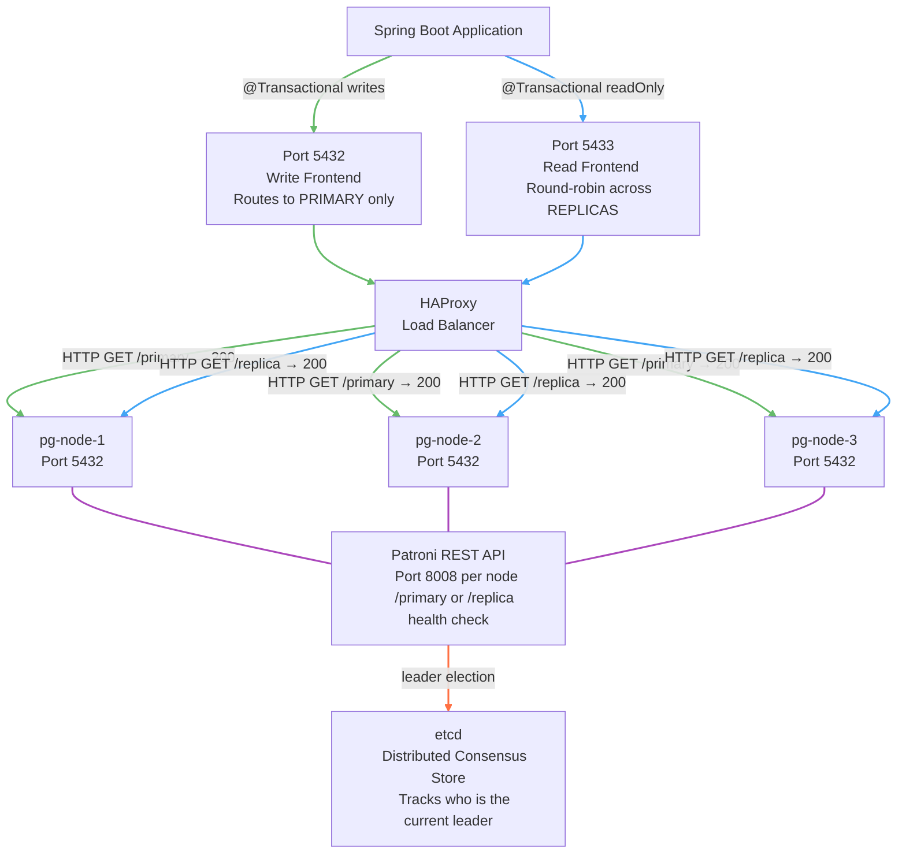
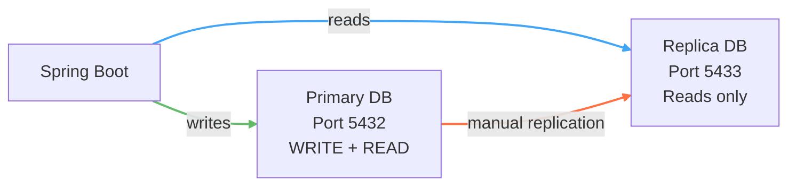
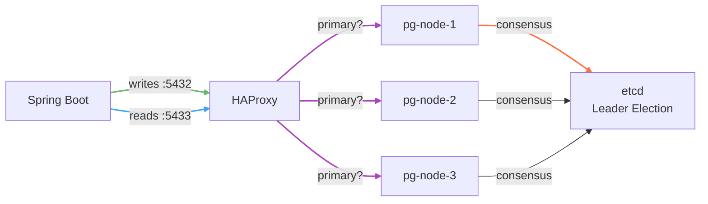

---

tags:

- Java
- SpringBoot
- Database
- HAProxy
- HighAvailability
- Patroni

---

**Target Audience:** Software Engineer 2 | Mid-Level Backend Mastery  
**Core Domain:** Distributed Systems, Advanced Spring Framework Architecture, and Infrastructure Scaling

---

## 🍃 Core Architectural Concepts & Study Guide



---

### 1. Old Setup vs. This Setup

Before understanding this architecture, it helps to see exactly what changed and why.

#### The Old Setup — 1 Primary, 1 Replica (Manual)



- Two fixed nodes — one is always the primary, one is always the replica
- Roles are hardcoded in `application.yml` as specific IPs/ports
- If the primary goes down, **manual intervention** is required to promote the replica
- `pg_hba.conf` had to be configured manually to control authentication rules
- No automatic failover — downtime until someone fixes it

#### This Setup — 3-Node Patroni Cluster with HAProxy (Automated)



- Three nodes where **any one** can become the primary at any time
- HAProxy queries each node's Patroni REST API (`/primary` or `/replica`) to discover who is currently the leader
- If the primary crashes, **Patroni + etcd automatically elects a new leader** from the remaining nodes — no manual intervention
- HAProxy detects the change on the next health check and reroutes traffic automatically
- `pg_hba.conf` is no longer manually managed — Spilo (the Docker image) auto-generates and manages it internally via Patroni's bootstrap configuration

---

### 2. How HAProxy Knows Who is Primary vs. Replica

HAProxy doesn't look at static IPs or fixed roles. It actively pings each node's **Patroni REST API** on port `8008` before every routing decision:

- `GET /primary` returns `HTTP 200` only on the current leader node — all others return `404`
- `GET /replica` returns `HTTP 200` on all follower nodes — the leader returns `404`

HAProxy uses these health checks to dynamically route:

- Port `5432` (write frontend) → only the node currently responding `200` to `/primary`
- Port `5433` (read frontend) → all nodes currently responding `200` to `/replica`, distributed via round-robin

This means **the role assignment is fluid** — when Patroni elects a new leader after a failure, HAProxy automatically picks it up on the next health check cycle without any configuration change.

---

### 3. HAProxy Configuration

```cfg
global
    log stdout format raw local0

defaults
    log     global
    mode    tcp
    timeout connect 5s
    timeout client  50s
    timeout server  50s

resolvers docker
    nameserver dns1 127.0.0.11:53   # Docker's internal DNS resolver
    resolve_retries 3
    timeout resolve 1s
    timeout retry   1s
    hold other      10s
    hold refused    10s
    hold nx         10s
    hold timeout    10s
    hold valid      10s
    hold obsolete   10s

# Write Port — routes exclusively to the current PRIMARY
frontend postgres_write_front
    bind *:5432
    default_backend postgres_write_back

backend postgres_write_back
    mode tcp
    option httpchk GET /primary          # Pings Patroni REST API on port 8008
    http-check expect status 200         # Only the primary responds 200
    server pg-node-1 sentiment-diary-pg-1:5432 check port 8008 resolvers docker resolve-prefer ipv4
    server pg-node-2 sentiment-diary-pg-2:5432 check port 8008 resolvers docker resolve-prefer ipv4
    server pg-node-3 sentiment-diary-pg-3:5432 check port 8008 resolvers docker resolve-prefer ipv4

# Read Port — round-robins across all current REPLICAS
frontend postgres_read_front
    bind *:5433
    default_backend postgres_read_back

backend postgres_read_back
    mode tcp
    balance roundrobin                   # Distributes reads evenly across healthy replicas
    option httpchk GET /replica          # Pings Patroni REST API on port 8008
    http-check expect status 200         # Only replicas respond 200
    server pg-node-1 sentiment-diary-pg-1:5432 check port 8008 resolvers docker resolve-prefer ipv4
    server pg-node-2 sentiment-diary-pg-2:5432 check port 8008 resolvers docker resolve-prefer ipv4
    server pg-node-3 sentiment-diary-pg-3:5432 check port 8008 resolvers docker resolve-prefer ipv4
```

---

### 4. Docker Compose — Local Development

> ⚠️ **Note:** The configuration below uses Docker container names as hostnames (e.g. `sentiment-diary-pg-1`). In production, these would be replaced with actual server IP addresses or DNS-resolved hostnames pointing to your cloud database instances.

```yaml
services:
  etcd:
    image: quay.io/coreos/etcd:v3.5.19
    container_name: sentiment-diary-etcd
    command:
      - etcd
      - --name=etcd0
      - --data-dir=/etcd-data
      - --listen-client-urls=http://0.0.0.0:2379
      - --advertise-client-urls=http://etcd:2379
      - --listen-peer-urls=http://0.0.0.0:2380
      - --initial-advertise-peer-urls=http://etcd:2380
      - --initial-cluster=etcd0=http://etcd:2380
      - --initial-cluster-state=new
    volumes:
      - etcd_data:/etcd-data
    healthcheck:
      test: ["CMD", "etcdctl", "--endpoints=http://localhost:2379", "endpoint", "health"]
      interval: 5s
      timeout: 5s
      retries: 10
    networks:
      - sentiment-net

  sentiment-diary-pg-1:
    image: ghcr.io/zalando/spilo-15:3.0-p1   # Spilo = PostgreSQL + Patroni bundled together
    container_name: sentiment-diary-pg-1
    hostname: pg-node-1
    environment:
      SCOPE: sentiment-cluster               # Cluster name — all nodes must share the same scope
      PGVERSION: "15"
      ETCD3_HOSTS: "etcd:2379"              # Points to etcd for leader election
      PATRONI_NAME: pg-node-1
      PATRONI_RESTAPI_LISTEN: "0.0.0.0:8008"
      PATRONI_RESTAPI_CONNECT_ADDRESS: "sentiment-diary-pg-1:8008"
      PATRONI_POSTGRESQL_CONNECT_ADDRESS: "sentiment-diary-pg-1:5432"
      PGPASSWORD_SUPERUSER: postgres_pass
      PGPASSWORD_REPLICATION: replicator_pass
      PGPASSWORD_ADMIN: sentiment_db_pass
      SPILO_CONFIGURATION: |
        bootstrap:
          initdb:
            - auth-host: md5
            - auth-local: trust
          post_bootstrap: "psql -U postgres -c 'CREATE DATABASE sentiment_db'"
    volumes:
      - pg_data_1:/home/postgres/pgdata
    depends_on:
      etcd:
        condition: service_healthy
    networks:
      - sentiment-net

  # pg-node-2 and pg-node-3 follow the same structure as pg-node-1
  # with their own PATRONI_NAME and CONNECT_ADDRESS values

  haproxy:
    image: haproxy:2.8
    container_name: sentiment-diary-haproxy
    ports:
      - "5432:5432"   # Write port — maps to host
      - "5433:5433"   # Read port — maps to host
    volumes:
      - ./haproxy.cfg:/usr/local/etc/haproxy/haproxy.cfg:ro
    depends_on:
      etcd:
        condition: service_healthy
    networks:
      - sentiment-net

  keycloak:
    image: quay.io/keycloak/keycloak:latest
    container_name: sentiment-diary-keycloak
    command: start-dev
    environment:
      KEYCLOAK_ADMIN: sentiment_keycloak_user
      KEYCLOAK_ADMIN_PASSWORD: sentiment_keycloak_pass
      KC_DB: postgres
      KC_DB_URL: jdbc:postgresql://haproxy:5432/sentiment_db   # Keycloak routes through HAProxy
      KC_DB_USERNAME: postgres
      KC_DB_PASSWORD: postgres_pass
    ports:
      - "9090:8080"
    depends_on:
      - haproxy
    networks:
      - sentiment-net

  minio:
    image: minio/minio:latest
    container_name: sentiment-diary-minio
    command: server /data --console-address ":9001"
    ports:
      - "9000:9000"
      - "9001:9001"
    environment:
      MINIO_ROOT_USER: sentiment_minio_user
      MINIO_ROOT_PASSWORD: sentiment_minio_pass
    volumes:
      - minio_data:/data
    networks:
      - sentiment-net

volumes:
  etcd_data:
  pg_data_1:
  pg_data_2:
  pg_data_3:
  minio_data:

networks:
  sentiment-net:
    driver: bridge
```

---

### 5. Updated `application.yml`

> 💡 **What changed from the old setup:**
> 
> - `driver-class-name` explicitly declared — required when configuring multiple datasources manually via `DataSourceBuilder`
> - `hibernate.dialect` explicitly set to `PostgreSQLDialect` — prevents Hibernate from guessing the wrong dialect on startup
> - Credentials changed to `postgres` / `postgres_pass` — matches the Spilo superuser credentials defined in the Docker Compose environment
> - `pg_hba.conf` is no longer manually configured — Spilo auto-generates and manages it internally via Patroni's `bootstrap.initdb` block. You no longer need to touch it.

```yaml
spring:
  application:
    name: api

  datasource:
    primary:
      jdbc-url: jdbc:postgresql://localhost:5432/sentiment_db
      username: postgres
      password: postgres_pass
      driver-class-name: org.postgresql.Driver    # Explicit — required for manual DataSourceBuilder
    replica:
      jdbc-url: jdbc:postgresql://localhost:5433/sentiment_db
      username: postgres
      password: postgres_pass
      driver-class-name: org.postgresql.Driver

  jpa:
    show-sql: true
    hibernate:
      ddl-auto: update
    properties:
      hibernate:
        dialect: org.hibernate.dialect.PostgreSQLDialect   # Explicit — prevents dialect guessing

  security:
    oauth2:
      resourceserver:
        jwt:
          issuer-uri: http://localhost:9090/realms/sentiment-diary-realm
          jwk-set-uri: http://localhost:9090/realms/sentiment-diary-realm/protocol/openid-connect/certs

keycloak:
  server-url: http://localhost:9090
  realm: sentiment-diary-realm
  client-id: sentiment-diary-api
  client-secret: zszNXsTBrNMVa8wsoJ3CJ06U7fq8jp2W
```

---

### 6. Glossary

| Component / Directive       | Real-World System Analogy                | Definitive Operational Meaning                                                                                                                                          |
| :-------------------------- | :--------------------------------------- | :---------------------------------------------------------------------------------------------------------------------------------------------------------------------- |
| **HAProxy**                 | **The Smart Traffic Cop**                | A high-performance TCP/HTTP load balancer that routes write traffic to the primary and distributes read traffic across replicas via health-check-based dynamic routing. |
| **Patroni**                 | **The Cluster Manager**                  | An open-source tool that wraps PostgreSQL and manages high-availability failover, leader election, and replication configuration automatically.                         |
| **Spilo**                   | **The Pre-Packaged Bundle**              | A Docker image from Zalando that ships PostgreSQL + Patroni pre-configured together, eliminating manual setup.                                                          |
| **etcd**                    | **The Election Authority**               | A distributed key-value store used by Patroni nodes to coordinate leader election and maintain consensus on who the current primary is.                                 |
| **`/primary` health check** | **The Leader Badge**                     | A Patroni REST API endpoint on port `8008` that returns `HTTP 200` only on the current primary node — HAProxy uses this to route writes.                                |
| **`/replica` health check** | **The Follower Badge**                   | A Patroni REST API endpoint on port `8008` that returns `HTTP 200` only on follower nodes — HAProxy uses this to route reads via round-robin.                           |
| **Round-Robin**             | **The Even Rotation**                    | A load balancing strategy that distributes incoming requests evenly across all healthy replica nodes in sequence.                                                       |
| **`pg_hba.conf`**           | **The Old Manual Auth File**             | PostgreSQL's host-based authentication config file. No longer manually managed — Spilo auto-generates it via Patroni's bootstrap configuration.                         |
| **`SCOPE`**                 | **The Cluster Name Tag**                 | An environment variable that groups Patroni nodes into the same cluster. All nodes in the same cluster must share the same `SCOPE` value.                               |
| **`driver-class-name`**     | **The Explicit JDBC Driver Declaration** | Required when manually building datasources via `DataSourceBuilder` — tells Spring which JDBC driver to load instead of auto-detecting it.                              |