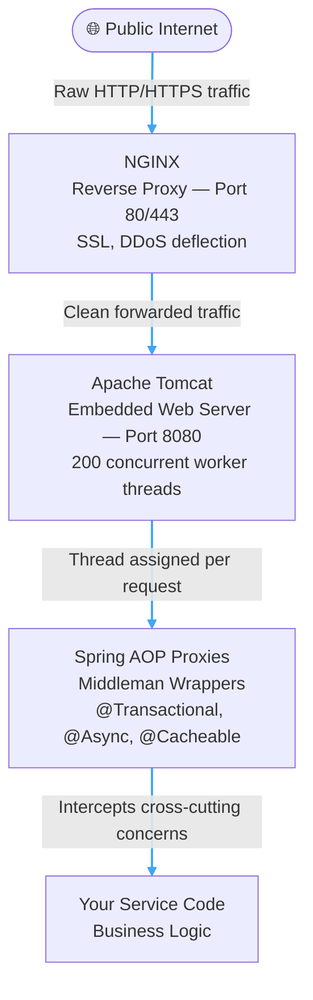
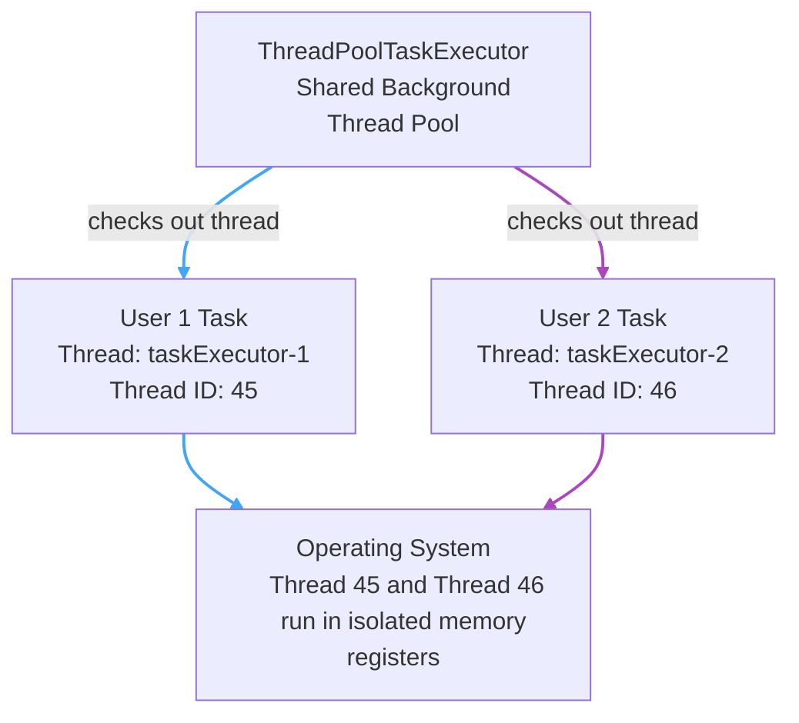
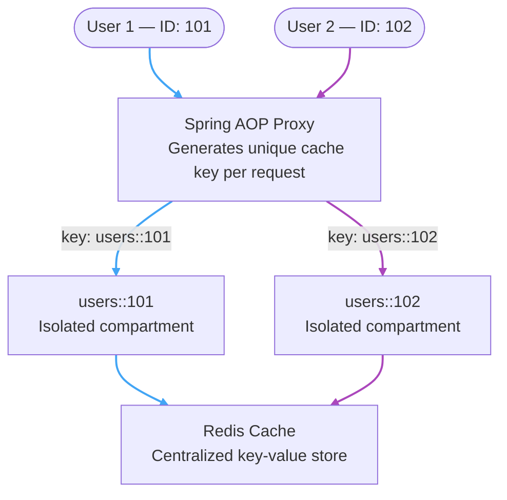

---
tags:
  - Java
  - SpringBoot
  - Architecture
  - RequestPipeline
aliases:
---
*A deep-dive map of the end-to-end journey of an HTTP request. Covers how Tomcat allocates threads, how Spring AOP proxies intercept execution to manage infrastructure concerns (Caching, Transactions, Security), and how the JVM isolates concurrent user data using separate thread pool mechanics.*

**Target Audience:** Software Engineer 2 | Mid-Level Backend Mastery  
**Core Domain:** Distributed Systems, Advanced Spring Framework Architecture, and Infrastructure Scaling

---

## 🍃 Core Architectural Concepts & Study Guide

---

### 1. The Big Picture — The Request Execution Pipeline

When an API request hits your backend infrastructure, it flows through a highly coordinated, multi-layered assembly line.

---

#### Layer 1: The Front Gate (NGINX)

- **What it is:** A high-speed public web server acting as a **Reverse Proxy** at the outermost edge of your server layout.
    
- **Its Job:** It faces the public internet (Ports 80/443), handles SSL certificates, deflects DDoS attacks, and forwards clean incoming API traffic inward to your application's private port (`8080`).

---

#### Layer 2: The Engine Room (Apache Tomcat)

- **What it is:** An embedded web server and servlet container packed directly inside your Spring Boot executable `.jar` file. It wakes up automatically on port `8080`.
    
- **Its Job:** It acts as the translator between raw network internet text and Java objects.
    
- **The Thread Pool:** Tomcat manages a baseline pool of **200 concurrent worker threads** (`http-nio-8080-exec-*`). When a request comes in, Tomcat assigns an individual thread from a `tomcat web thread pool` to drive that request through your code. By default, Tomcat doesn't just spawn all 200 threads right when your Spring Boot app boots up. Doing that would waste a massive amount of system memory for no reason. Instead, Tomcat manages threads **elastically** using a dynamic scaling strategy.
    
- **The Concurrency Shield:** The JVM isolates these threads using **Private Stack Frames**. Every variable or query result declared inside a method lives inside that thread's private memory bucket. Because User 1 (Thread-01) and User 2 (Thread-02) have completely separate Stacks, **it is physically impossible for concurrent users to overwrite each other's data**—as long as your Spring beans remain stateless.

---

#### Layer 3: The Traffic Dispatcher (Spring AOP Proxies)

- **What it is:** Aspect-Oriented Programming proxies are invisible **middleman wrappers** that Spring places around your raw OOP service classes at startup.
    
- **Its Job:** It intercepts Tomcat's threads right at the doorstep of your methods to run repetitive infrastructure tasks (Cross-Cutting Concerns) cleanly behind the scenes, keeping your actual business logic pristine. In `@Async` methods, it stops the Tomcat method, takes the payload and pass it to the `background task pool` to avoid cluttering the `tomcat web thread pool`. It's also responsible for handling `@Transactional`, `@PreAuthorize`, and `@Secured` annotations, as well as handling logs.

---

### 2. The ID Isolation Mechanism — User 1 vs. User 2

When multiple users hit the exact same backend code simultaneously, the system doesn't mix up their data. It relies on a **Global Pool + Unique ID Tracking** architecture to process traffic in parallel.

#### Concurrent Async Processing — Thread ID Assignment

When User 1 and User 2 both click "Export Heavy Excel" at the same millisecond:

Both tasks share the same thread pool but never share a thread. The OS uses numeric Thread IDs to ensure Thread 45's calculations can never bleed into Thread 46's memory registers.

#### Concurrent Caching — Cache Key Namespace Isolation

When User 1 and User 2 both look up a profile at the same time, they share the same Redis instance but AOP bakes their unique Domain IDs directly into the cache key:

Thousands of users share the same cache engine simultaneously without a single byte of data crossing streams.

>💡 **Quick Note:** 
>- Multiple users can cache data simultaneously in a single app because each user's thread uses an **AOP Proxy** to dynamically stamp their unique **Domain ID** into a cache key (e.g., `user_cache::101`), storing their data in isolated compartments inside the application's local RAM cache.
>- **For Reads:** AOP uses the unique ID to grab data instantly from the local cache and make an immediate U-turn, completely saving the database from handling the thread.
>- **For Writes:** AOP uses the unique ID to update the database and instantly delete the old local cache compartment, ensuring the user never sees stale data on their next turn.
>- **The Pool Rule:** All standard application processes and user requests run concurrently on the **same global Tomcat thread pool**, whereas `@Async` methods are uniquely offloaded to their own separate background thread pool to prevent blocking the main app.

---

### 3. Glossary

|Component|Architecture Role|Technical Manifestation|Data Isolation Mechanism|
|:--|:--|:--|:--|
|**NGINX**|Public Front Gate / Proxy|External Server Layer|Network Ports & IP Routing|
|**Tomcat**|Web Container / Thread Owner|Embedded on Port `8080`|Thread-per-Request Allocation|
|**JVM Stack**|Data Isolation per Thread|Private Thread Memory|Thread IDs / Separate Stack Frames|
|**AOP Proxy**|Code Wrapper / Traffic Cop|Dynamic Memory Subclass|Interception & Context Routing|
|**Redis**|High-Speed Data Shortcut|Key-Value Cache Store|Cache Key IDs (`namespace::id`)|