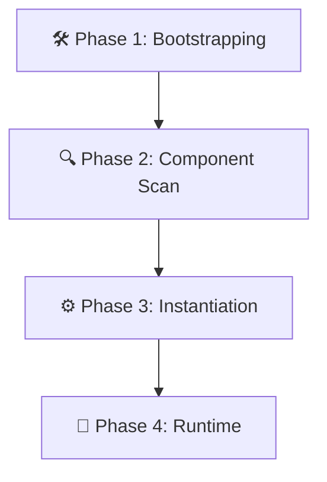
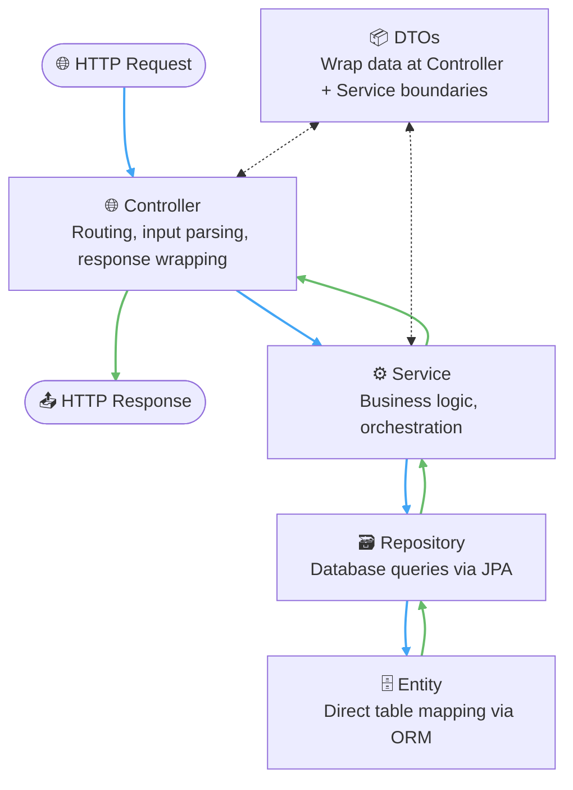

---

tags:

- Java
- SpringBoot
- SpringBootLifeCycle
- Introduction

---

**Target Audience:** Software Engineer 2 | Mid-Level Backend Mastery  
**Core Domain:** Distributed Systems, Advanced Spring Framework Architecture, and Infrastructure Scaling

---

## 🏗️ Core Architectural Concepts & Study Guide



---

### 🏭 1. The Shortened Spring Boot Lifecycle (The Assembly Line)

Forget standard directory layouts or relative filesystem paths at application runtime. Spring Boot reads your code layout and flattens your components into a unified, high-speed execution grid in RAM through a distinct **4-Stage industrial assembly line**:

1. **Phase 1: Bootstrapping**
    
    - You invoke `SpringApplication.run()`. The core framework engine launches in memory.
    - The environment parses global properties (`application.properties` or `application.yml`).
    - Hidden, basic framework defaults are put into place (e.g., standard security lockouts blocking endpoints, fallback single database connections).
2. **Phase 2: Component Scan**
    
    - Spring inspects the root package declaration housing your `@SpringBootApplication` entry class.
    - The engine initiates a recursive **downward sweep** across all structural child directories.
    - It tags every file broadcasting a recognizable framework "signal flare" annotation: `@Component`, `@Service`, `@Repository`, `@RestController`, or `@Configuration`.
3. **Phase 3: Instantiation & Wiring (The Priority Handoff)**
    
    - Spring executes class construction instructions, reserving blocks in RAM to turn your raw code structures into active **Beans**.
    - It fulfills dependency requirements by injecting relevant beans into each other via method parameters or constructors.
    - ⚠️ **The Rule of Priority Substitution:** If Spring encounters a custom configuration bean designed explicitly by _you_, it immediately discards its internal default fallback template and activates your custom logic instead.
4. **Phase 4: Runtime Execution**
    
    - The highly interconnected web of fully populated components rests idling in memory.
    - When an API request strikes an active routing destination, the payload completely bypasses traditional file-seeking operations and cascades instantly through your pre-assembled tool belt grid.

---

### 🛠️ 2. Core Architectural Engineering Realities

The "magic" of Spring Boot is entirely demystified when broken down into explicit architectural patterns:

- **The Flat Tool Belt vs. Relative File Paths**
    
    - Unlike frontend ecosystems (React, Node) that continuously track complex file paths (`../../utils/helper`), Spring removes structural navigation entirely. Once scanning completes, your services sit side-by-side inside a flattened, instantly accessible application tool belt.
- **The `@Bean` Custom Factory Engine**
    
    - Stereotype markers like `@Service` or `@Repository` instruct Spring to manufacture basic items out of your own files.
    - Conversely, you use the `@Bean` annotation inside configurations when you are tasked with manually constructing external tools from third-party frameworks (e.g., configuring an individual `RedisTemplate` or setting up an encrypted Apache Kafka client factory). You invoke the external class, modify properties inside the method wrapper, and yield the finished asset back into Spring's control.
- **Method-Level Parameter Injection**
    
    - When writing structures like `public SecurityFilterChain filterChain(HttpSecurity http)`, you recognize that you cannot manually use `new HttpSecurity()`.
    - Spring owns and handles the massive structural foundation of the security engine, but you maintain the blueprint changes. Spring feeds the raw engine tool through your parameter, you append explicit path configurations, and return the modified filter chain back to the system framework.
- **The Conflict Resolution Matrix (`@Primary` vs. `@Qualifier`)**
    
    - When multiple identical twin bean types reside together inside the toolbox (such as your `primaryDataSource` and `replicaDataSource`), Spring stops execution due to bean ambiguity. You resolve this dilemma via two opposite strategies:
        - `@Primary` acts as **The House Special**: It tags an explicit bean variant as the default option whenever a service requests that variable type without providing a specific name tag.
        - `@Qualifier("exactName")` acts as **The Custom Menu Order**: It is attached directly to injection parameters to override defaults and extract a specific bean twin using its explicit, string-registered method name.

---

### 🧱 3. The Full Request-Response Stack

A Spring Boot API follows a strict, layered architecture. Each layer has one responsibility — understanding this pipeline is critical for debugging, scaling, and clean code.



---

#### 🗄️ 3a. Entity — The Database Mirror

An `@Entity` class is a direct 1-to-1 Java representation of a database table row. Spring (via JPA/Hibernate) handles all SQL generation automatically.

```java
import jakarta.persistence.*;
import lombok.Data;

@Entity           // Marks this class as a JPA-managed table mapping
@Data             // Lombok: auto-generates getters, setters, equals, hashCode, toString
@Table(name = "products")
public class Product {

    @Id
    @GeneratedValue(strategy = GenerationType.IDENTITY) // Auto-increment PK
    private Long id;

    @Column(name = "name")
    private String name;

    @Column(name = "description")
    private String description;

    @Column(name = "stock_quantity")
    private Integer stockQuantity;

    @Column(name = "price")
    private Double price;
}
```
 

> ⚠️ **Rule:** Entities should never be returned directly from controllers. Always map to a **DTO** first to control what data is exposed.

---

#### 🗃️ 3b. Repository — The Database Gateway

The repository is your data-access layer. Extending `JpaRepository<Entity, ID>` gives you free CRUD operations (`save`, `findById`, `findAll`, `delete`) without writing any SQL.

```java
import com.pcpartsshop.api.entity.Product;
import org.springframework.data.domain.Page;
import org.springframework.data.domain.Pageable;
import org.springframework.data.jpa.repository.JpaRepository;

public interface ProductRepository extends JpaRepository<Product, Long> {

    // Spring derives the SQL query entirely from the method name
    Page<Product> findByNameContainingIgnoreCaseOrDescriptionContainingIgnoreCase(
        String name, String description, Pageable pageable
    );
}
```
 

|Feature|What it does|
|:--|:--|
|`JpaRepository<Product, Long>`|Provides built-in CRUD + pagination for `Product`, keyed by `Long` ID|
|Method name derivation|Spring reads `findBy...ContainingIgnoreCase` and generates the `LIKE` query|
|`Page<T>` + `Pageable`|Returns a slice of results with metadata (total pages, total elements)|

---

#### 🌐 3c. Controller & Routing — The Traffic Director

The controller is the entry point for all HTTP traffic. It maps URL paths to handler methods and delegates logic immediately to the service layer — it should contain **no business logic itself**.

```java
import com.pcpartsshop.api.dto.ApiResponse;
import com.pcpartsshop.api.dto.product.ProductRequest;
import com.pcpartsshop.api.dto.product.ProductResponse;
import com.pcpartsshop.api.service.ProductService;
import jakarta.validation.Valid;
import org.springframework.beans.factory.annotation.Autowired;
import org.springframework.data.domain.Page;
import org.springframework.http.HttpStatus;
import org.springframework.http.ResponseEntity;
import org.springframework.web.bind.annotation.*;

@RestController                      // Combines @Controller + @ResponseBody (auto-serializes returns to JSON)
@RequestMapping("/api/products")     // Base path prefix for all methods in this controller
public class ProductController {

    @Autowired
    private ProductService productService;

    // GET, POST, PUT, DELETE methods delegating to productService...
    @GetMapping  
	public Page<ProductResponse> getAllProducts(  
	        @RequestParam(required = false) String search,  
	        @RequestParam(defaultValue = "0") Integer page,  
	        @RequestParam(defaultValue = "10") Integer size  
	) {  
	    return productService.getAllProducts(search, page, size);  
	}
}
```
 

**Routing Annotations at a Glance:**

|Annotation|HTTP Method|Typical Use|
|:--|:--|:--|
|`@GetMapping`|`GET`|Fetch one or many resources|
|`@PostMapping`|`POST`|Create a new resource|
|`@PutMapping("/{id}")`|`PUT`|Replace/update a resource by ID|
|`@DeleteMapping("/{id}")`|`DELETE`|Remove a resource by ID|
|`@PathVariable`|—|Extracts `{id}` from the URL path|
|`@RequestParam`|—|Extracts `?search=...&page=0` query params|
|`@RequestBody`|—|Deserializes the JSON body into a DTO|
|`@Valid`|—|Triggers Bean Validation on the incoming DTO|

**Defined Routes for `ProductController`:**

|Method|Path|Description|
|:--|:--|:--|
|`GET`|`/api/products`|Returns a paginated list; accepts `?search=`, `?page=`, `?size=`|
|`GET`|`/api/products/{id}`|Returns a single product or throws `ResourceNotFoundException`|
|`POST`|`/api/products`|Creates a product from a validated `ProductRequest` body|
|`PUT`|`/api/products/{id}`|Updates a product by ID; 404 if not found|
|`DELETE`|`/api/products/{id}`|Deletes a product by ID; returns the deleted snapshot|

---

#### ⚙️ 3d. Service — The Business Logic Engine

The service layer owns all business decisions. It reads from the repository, applies logic, and maps raw entities into response DTOs before returning them upstream.

```java
import com.pcpartsshop.api.dto.product.ProductRequest;
import com.pcpartsshop.api.dto.product.ProductResponse;
import com.pcpartsshop.api.entity.Product;
import com.pcpartsshop.api.repository.ProductRepository;
import org.springframework.beans.factory.annotation.Autowired;
import org.springframework.data.domain.*;
import org.springframework.stereotype.Service;
import java.util.Optional;

@Service
public class ProductService {

    @Autowired
    private ProductRepository productRepository;

    public Page<ProductResponse> getAllProducts(String search, Integer page, Integer size) {
        Pageable pageable = PageRequest.of(page, size);
        Page<Product> productPage = (search != null && !search.trim().isEmpty())
            ? productRepository.findByNameContainingIgnoreCaseOrDescriptionContainingIgnoreCase(search, search, pageable)
            : productRepository.findAll(pageable);

        return productPage.map(this::toResponse);
    }

    public Optional<ProductResponse> getProductById(Long id) {
        return productRepository.findById(id).map(this::toResponse);
    }

    public ProductResponse createProduct(ProductRequest request) {
        Product product = new Product();
        product.setName(request.getName());
        product.setDescription(request.getDescription());
        product.setStockQuantity(request.getStockQuantity());
        product.setPrice(request.getPrice());
        return toResponse(productRepository.save(product));
    }

    // updateProduct() and deleteProduct() follow the same Optional.map() pattern

    private ProductResponse toResponse(Product product) { /* maps entity fields → ProductResponse DTO */ }
}
```
 

> 💡 **Why `Optional<T>`?** Rather than returning `null` (which causes `NullPointerException`), the service returns `Optional.empty()` when a record isn't found. The controller then chains `.orElseThrow()` to produce a clean 404 error.

---

#### 📦 3e. DTOs — The Data Contracts

DTOs (Data Transfer Objects) decouple your internal data model (Entity) from what you send and receive over the wire. There are two directions:

**`ProductRequest` — Inbound (client → server)**

```java
import jakarta.validation.constraints.*;
import lombok.Data;

@Data
public class ProductRequest {

    @NotBlank(message = "Name cannot be blank.")
    @Size(max = 100, message = "Name must be under 100 characters.")
    private String name;

    @NotBlank(message = "Description cannot be blank.")
    private String description;

    @NotNull(message = "Stock quantity cannot be null.")
    @Min(value = 0, message = "Stock quantity cannot be negative.")
    private Integer stockQuantity;

    @NotNull(message = "Price cannot be null.")
    @DecimalMin(value = "0.0", inclusive = false, message = "Price must be greater than 0.")
    private Double price;
}
```
 

**`ProductResponse` — Outbound (server → client)**

```java
import com.pcpartsshop.api.dto.review.ReviewSummaryResponse;
import java.util.List;

public record ProductResponse(
        Long id,
        String name,
        String description,
        Integer stockQuantity,
        Double price,
        List<ReviewSummaryResponse> reviews  // enriched — the Entity itself doesn't hold reviews directly
) {}
```
 

**Shared Wrappers**

```java
// Generic success envelope
public record ApiResponse<T>(Integer statusCode, String message, T data) {}

// Generic error envelope — used by the global exception handler
public record ErrorResponse(Integer statusCode, String error, Object message) {}
```
 

> 💡 **`class` vs `record`:** `ProductRequest` is a mutable `@Data` class because it needs setters for JSON deserialization. `ProductResponse` is an immutable `record` because it is a read-only outbound contract — records auto-generate a constructor, getters, `equals`, and `hashCode` for free.

---

### 🛡️ 4. The Custom Validation Pattern (Sticker & Worker Mechanics)

Enforcing complex domain rules — like ensuring a user's confirmation password matches, or verifying a product's selling price is higher than its cost price — relies on a decoupled, two-part class configuration:

```
  DTO Object [ @GoodSellingPrice ]  <--- (The Sticker Blueprint)
        │
        ▼ (Spring Intercepts Payload)
  PriceValidator.isValid()          <--- (The Worker Logic Machine)
```

#### File A: The Annotation Definition (The Sticker Blueprint)

Defines where the annotation can be typed, when it is processed by the compiler, and which logic processor it triggers.

```java
package com.pcpartsshop.api.validation;

import jakarta.validation.Constraint;
import jakarta.validation.Payload;
import java.lang.annotation.*;

@Target({ElementType.TYPE, ElementType.ANNOTATION_TYPE}) // Placed on a Class/DTO level to read multiple fields at once
@Retention(RetentionPolicy.RUNTIME)                      // Stays live in RAM during application execution
@Constraint(validatedBy = PriceValidator.class)          // The structural link specifying the worker class
@Documented
public @interface GoodSellingPrice {
    String message() default "Selling price is less than bought price. Focus on profit!";
    Class<?>[] groups() default {};                      // Boilerplate requirements for compilation
    Class<? extends Payload>[] payload() default {};     // Boilerplate requirements for compilation
}
```

 
#### File B: The Validator Implementation (The Worker Logic Machine)

Implements standard validation contracts, accepts target payloads into method parameters, and calculates a true/false outcome.

```java
package com.pcpartsshop.api.validation;

import com.pcpartsshop.api.dto.product.ProductRequest;
import jakarta.validation.ConstraintValidator;
import jakarta.validation.ConstraintValidatorContext;

public class PriceValidator implements ConstraintValidator<GoodSellingPrice, ProductRequest> {

    @Override
    public boolean isValid(ProductRequest request, ConstraintValidatorContext context) {
        // Prevent NullPointerExceptions if the user passes an unpopulated request payload
        if (request.getBoughtPrice() == null || request.getSellingPrice() == null) {
            return false;
        }

        // Returns TRUE if validation passes (business logic requirement is fulfilled)
        // Returns FALSE if validation fails (Spring intercepts and rolls back with error message)
        return request.getSellingPrice() > request.getBoughtPrice();
    }
}
```

 

---

### 📖 5. Glossary

| Component / Directive                         | Real-World System Analogy     | Definitive Operational Meaning                                                                                                                         |
| :-------------------------------------------- | :---------------------------- | :----------------------------------------------------------------------------------------------------------------------------------------------------- |
| **Application Context / IoC**                 | **The Factory Toolbox**       | The centralized memory storage layout housing every instantiated, active component bean inside your running application.                               |
| **Bean**                                      | **The Active Tool**           | A living instance of a class managed directly by the framework context. _An entire Object residing in RAM, not an isolated method._                    |
| **`@Component` / `@Service` / `@Repository`** | **Standard Tooling Orders**   | Class-level markers indicating that Spring must automatically handle construction lifecycle operations at application boot.                            |
| **`@Bean`**                                   | **Custom Hand-Crafted Tools** | Method-level markers indicating you are manually constructing, modifying, and exporting an external object to the context toolbox.                     |
| **`@Autowired`**                              | **The Structural Bridge**     | Instructs Spring to traverse its active toolbox, extract a requested dependency matching that target description, and plug it right into your file.    |
| **`@Primary`**                                | **The Default Menu Option**   | Assigns priority to a specific bean candidate to satisfy dependency requirements automatically when multiple twins match the object type.              |
| **`@Qualifier("name")`**                      | **The Specific Menu Order**   | Bypasses general default assumptions entirely by forcing the parameter engine to fetch a bean matching an exact string identity tag.                   |
| **`@Target` & `@Retention`**                  | **The Sticker Parameters**    | Boilerplate meta-annotations indicating exactly _where_ an input sticker can be typed on your source code and _how long_ its memory tracking persists. |
| **Entity**                                    | **The Database Mirror**       | A Java class annotated with `@Entity` that maps directly to a database table row. Managed by JPA/Hibernate.                                            |
| **Repository**                                | **The Database Gateway**      | An interface extending `JpaRepository` that provides free CRUD and query-derivation without raw SQL.                                                   |
| **DTO**                                       | **The Data Contract**         | A purpose-built object that shapes what data travels _in_ (`Request`) or _out_ (`Response`) over the wire, decoupled from the Entity.                  |
| **`record`**                                  | **The Immutable Snapshot**    | A Java construct that auto-generates constructor, getters, `equals`, and `hashCode`. Ideal for read-only outbound response DTOs.                       |
| **`Optional<T>`**                             | **The Safe Nullable Wrapper** | A container that either holds a value or is empty — prevents `NullPointerException` and forces the caller to handle the absent case explicitly.        |

---